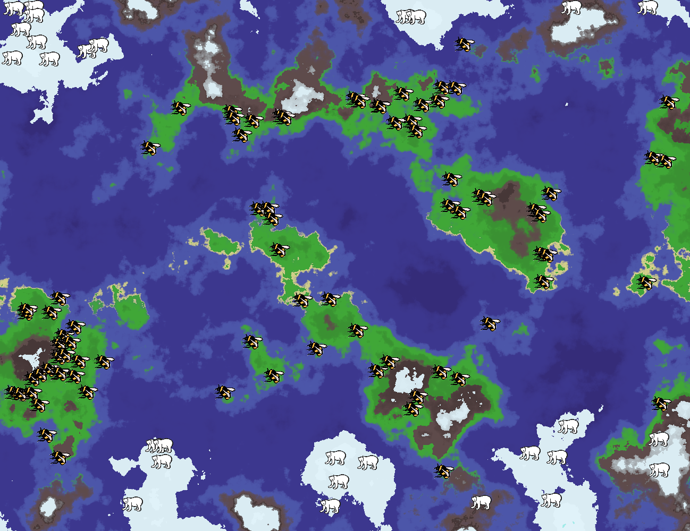
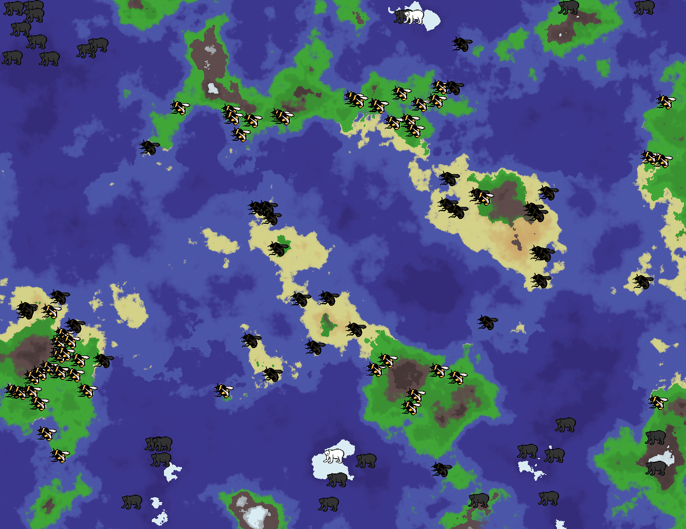

## Educational Tool for Climate Change Visualisation - 2019/2020

***To run this application, you must have Java 8 installed.**

### Preview of changes to the environment

Initial environment state
After 100 years of climate change

### Using the application
To try and test the application, simply open a terminal in the `climate-change-visualisation` directory and run the command `java app.jar`, 
or double click `app.jar` from the file explorer.

### Running the project in IntelliJ IDEA

To access the code and run it yourself in IntelliJ IDEA, take the following steps:
- Right click the `climate-change-visualisation` directory and click **Open Folder as IntelliJ IDEA Project**. Alternatively, 
with IntelliJ IDEA open, click `File > New > Project From existing Sources` and select the `climate-change-visualisation` folder. 
Leave all the other settings as they are to create the project.
- After the project is created, go to `File > Project Structure > Project` and set the **Project SDK** to **1.8**
- Set the **Project language level** to **8 - Lambdas, type annotations etc.**
- Create a new directory `out` inside the root folder `climate-change-visualisation`. From `File > Project Structure > Project`, set this 
 folder as the **Project compiler output** by typing or selecting its path.
- From the project file list, right click the `src` folder and press `Mark Directory as > Source Root`. Mark `resources` 
as the `Resource Root` directory and `test` as the `Test Root` directory the same way.
- Finally, run the main method by opening the `climate-change-visualisation > src > aib > Main` file and then clicking 
`Run > Run... > Main > Run` from the application bar.

### Libraries
#### [FastNoise by Jordan Peck](https://github.com/Auburns/FastNoise_Java)
Library used to generate noise values from my samples. I replaced javax.vecmath.Vector2f and javax.vecmath.Vector3f with 
com.sun.javafx.geom.Vec2f and com.sun.javafx.geom.Vec3f because javax is no longer part of Java and I already use JavaFX.\
*The class is included in my project structure, so you do not need to add it in.

#### [ZoomableScrollPane by Daniel Hári](https://stackoverflow.com/a/44314455)
Replacement for the JavaFX ScrollPane, for the added functionality of zooming.Used as a container for the map, so it can 
be zoomed in on.\
*The class is included in my project structure, so you do not need to add it in.